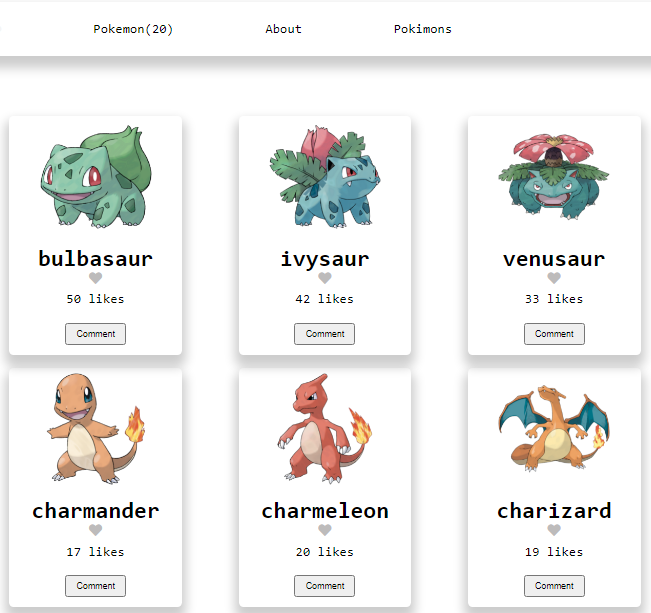
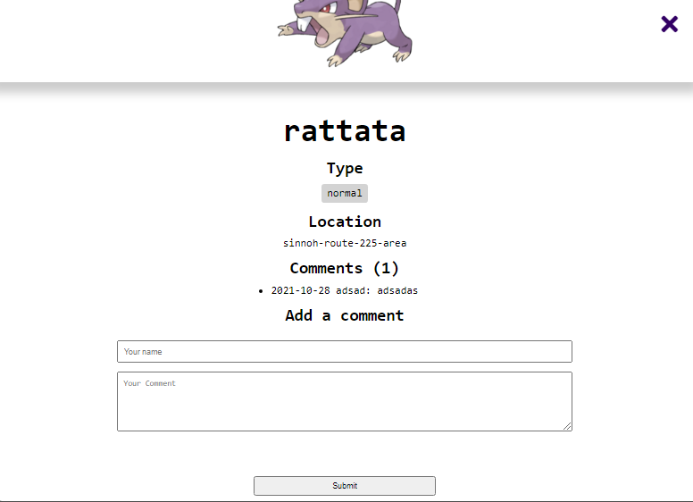

# API Leaderboard

> kanbanBoard is an API based webapp that displays cards containing information (like their image, type and location) about different pokemon. This is a single-page application(SPA) which contains the home page and comments modal pop-ups.
>  > 

> [Live preview](https://mucyosoda.github.io/kanbanBoard/dist/)

Additional description about the project and its features.

- Cards are display dynamically
- After make any changes they are sent to the API
- When you reload a page, it updates by getting back the API information

## Built With

- 
- 
- 
- 
- 
- 
- 
- 

## periquities

If you wish to run the project locally, please do the following:

1.- Install Node.js and npm if you haven't already.
To install Node.js, follow the instructions on [Node.js](https://nodejs.org/en/).

To install npm, run the following command in your terminal:

```bash
npm install -g npm
```

2.- Install webpack and linters.
To install webpack, run the following command in your terminal:

```bash
npm install -g webpack
```

or follow the instructions on [webpack](https://webpack.js.org/).
To install linters, run the following command in your terminal:

```bash
npm install -g eslint
npm install -g stylelint
npm install -g webhint
```

or follow the instructions on [eslint](https://eslint.org/), [stylelint](https://stylelint.io/), and [webhint](https://webhint.io/).

Also you can clone the repository and most of the jobs will be done for you.

Once you have the setup and the project locally, you can run the project using the following command in your terminal:

```bash
npm run build
```

## Tests

If you want to run the tests, do the following:
1.- Install Node.js and npm if you haven't already. Or you can use yarn if you prefer.

2.- Install Jest using npm or yarn. You can check here how to do it: [Jest](https://jestjs.io/es-ES/docs/getting-started).

3.- Run `npm test` or `yarn test` to run the tests.

4.- you can add the jest coverage so it covers all your code and show percentage left

Or

You can run `git clone https://github.com/Mucyosoda/kanbanBoard.git` to clone the repository and avoid all the installation steps because tests are set as a dependency.
Happy coding!

👤 **Author**

- Name: Mucyo Claude Ntacyonungutse
- GitHub: [@Mucyosoda](https://github.com/Mucyosoda)
- Name: Aladdin Alsalem
- Twitter: [@AlaaAlsalem](https://github.com/AlaaAlsalem)

## 🤝 Contributing

Contributions, issues, and feature requests are welcome!

Feel free to check the [issues page](../../issues/).

## Show your support

Give a ⭐️ if you like this project!

## Acknowledgments

- Thanks to microverse

## 📝 License

This project is [MIT](./LICENSE.md) licensed.
