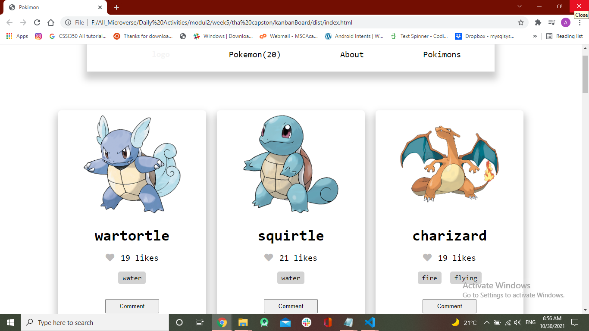

# kanbanBoard

> kanbanBoard is an API based webapp that displays cards containing information (like their image, type and location) about different pokemon. This is a single-page application(SPA) which contains the home page and comments modal pop-ups.

# Getting Started

To get a local copy up and running follow these simple steps.

- You can clone this repo by typing `git clone https://github.com/Mucyosoda/kanbanBoard.git` on your terminal.

- Type `cd kanbanBoard` to access the project on the terminal.
  
- Run `npm install` from your editor's terminal.

- Run `npm run build` from your editor's terminal.

- Run `npm start` from your editor's terminal to view the project in your browser.

# This project was built with:

HTML5

CSS3

JavaScript

Webpack

Jest Library
# Version Control System

GIT

# 👤 Authors

👤 **Aladdin Alsalem**

GitHub: [@Aladdin](https://github.com/AlaaAlsalem)

LinkedIn: [Aladdin](https://www.linkedin.com/in/aladdin-alsalem-5a68ba1a0/)

👤 ****

# 🤝 Contributing

Contributions, issues, and feature requests are welcome!

# Show your support

Give a ⭐️ if you like this project!

# Acknowledgement

- A big thanks to [PokeAPI](https://pokeapi.co/) for making the API endpoints readily available for use.
 
# 📝 License

This project is [MIT](LICENSE) licensed.
